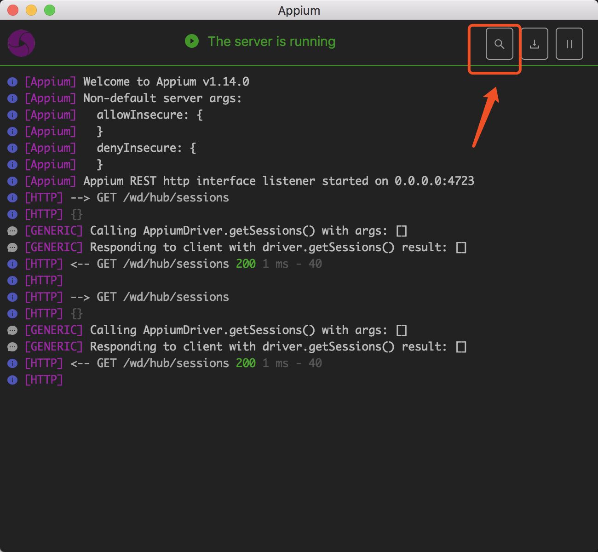
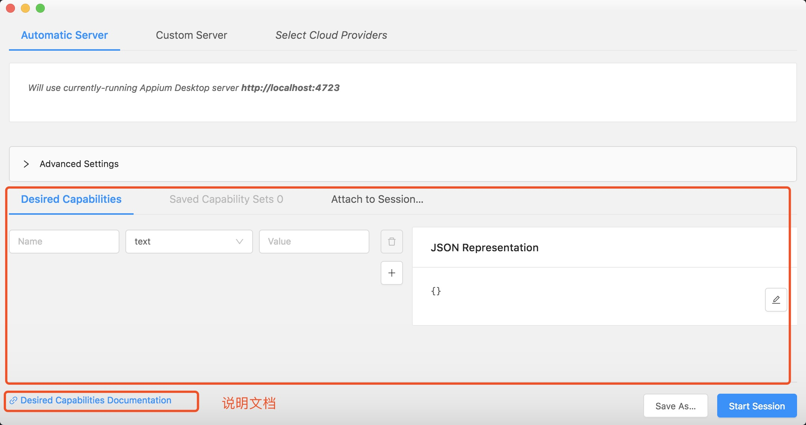

# 关于 Appium

Appium 是一个开源工具，用于在 iOS 移动，Android 移动和 Windows 桌面平台上自动化本机、移动 Web、混合应用程序、原生应用程序。
原生应用程序是使用 iOS，Android 或 Windows SDK 编写的应用程序。
移动网络应用程序是使用移动浏览器访问的网络应用程序（Appium 支持 iOS 和 Chrome 上的 Safari 或 Android 上的内置“浏览器”应用程序）。
混合应用程序包含一个“webview”包装器 - 一个本机控件，可以与 Web 内容进行交互。
Apache Cordova 或 Phonegap 等项目可以轻松地使用 Web 技术构建应用程序，然后捆绑到本机包装器中，创建混合应用程序。

重要的是，Appium 是“跨平台的”：它允许您使用相同的 API 针对多个平台（iOS，Android，Windows）编写测试。这使得 iOS，Android 和 Windows 测试套件之间的代码重用成为可能。

有关 Appium“支持”其平台和自动化模式的具体信息，请参阅平台支持文档。

ps: Appium 服务端是基于 node 开发

## 环境

java sdk 环境 或单独配置 jre 环境
node
npm

## 安装方法

参考[官网文档](http://appium.io/docs/en/about-appium/getting-started/index.html#getting-started)

## 验证安装

```shell
npm install -g appium-doctor
appium-doctor --ios
appium-doctor --android
```

## appium desktop 配置 Desired Capabilities 方法（也可以客户端发送）

[配置文档](http://appium.io/docs/en/writing-running-appium/caps/index.html)





## appPackage 及 appActivity 获得方法

1. 叫开发给
2. 通过 apktool 反编译 apk，打开 AndroidManifest.xml 查看
