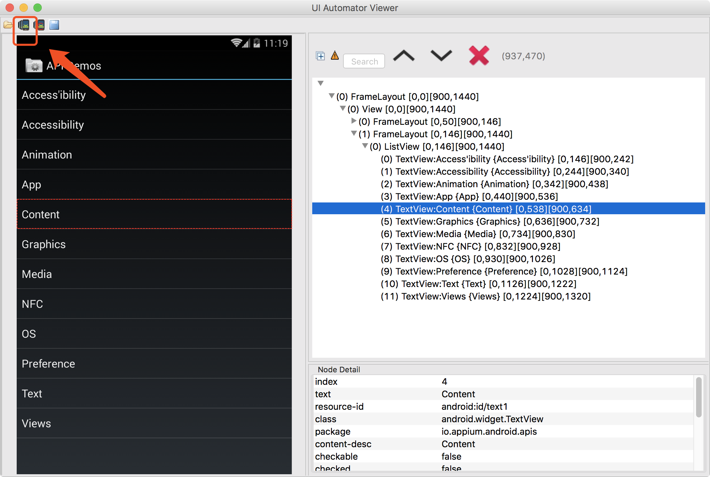

# 应用元素定位方法

## Android-uiautomatorviewer

Android 借助 uiautomatorviewer 定位元素

uiautomatorviewer 位于 Android SDK-》tools-》bin 目录下

首先将设备调整至要分析的页面，打开uiautomatorviewer，点击左上角的第二个图标按钮 Device Screenshot，将会显示当前设备界面的快照及元素层级。

最后查找自己想要的元素信息

